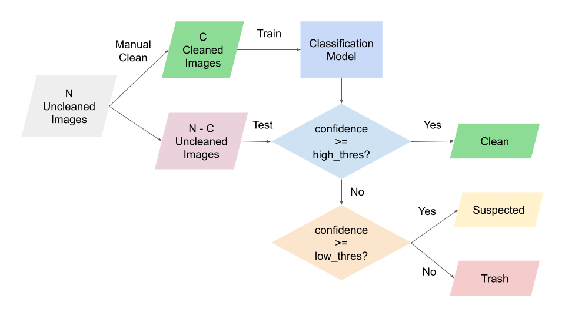

# Chula-Food ML Cleaner



## Instruction

1) Install required packages and dependencies.

    ```shell
    pip install -r requirements.txt
    ```


2) Copy your dataset to folder `data`. The folder structure must follow the below structure.

    ```
    data
    |
    |--- set
    |     |--- class
    |     |--- class
    |     |--- class
    |
    |--- set
    |     |--- class
    |     |--- class
    |
    ```
  
  
3) Run `prepare_folder.py` to create `train` and `test` folders.

   ```shell
   python prepare_folder.py -n <YOUR_SET_NAME>
   ```
   
   where `<YOUR_SET_NAME>` must exactly match the name of a dataset placed on folder `data`.


4) For each class in the dataset, move some amount of cleaned data (e.g., 20) from folder `test` to folder `train`.
   
   The number of training data per class must be consistent with other classes in the dataset.
  
  
5) Run `run_cleaner.py` to bake a new model and get tedious stuff done.
   
   Folders `clean`, `suspected`, and `trash` will be created on `data/<YOUR_SET_NAME>`.

   ```shell
   python run_cleaner.py -n <YOUR_SET_NAME>
   ```
   
   - You could speed up the training by specifying `--batch_size` or `-b` and set it to the largest number you can use without an error.
   
   - `low_threshold` and `high_threshold` can be adjusted by specifying `-lt` and `-ht`.
   
   - If you have trained the model on that dataset but want to rerun the experiment for some reasons, such as trying with the new `low_threshold` and `high_threshold`,
   you can specify `-m True` to load the trained model or `-p True` to load the saved prediction.

6) Check the prediction. The model is not perfect anyway!
   
   Note that you don't have to copy files from `train` to `clean`. The script has already done that for you.
